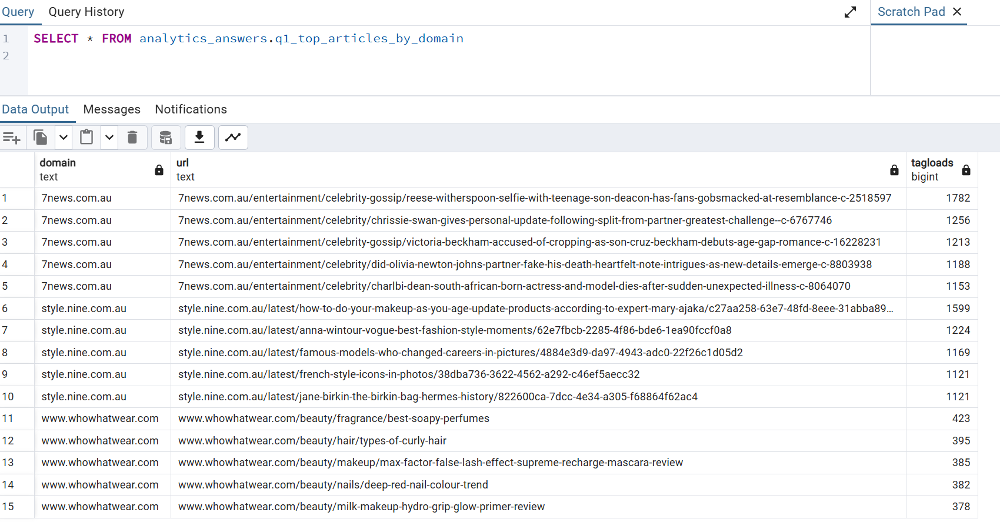
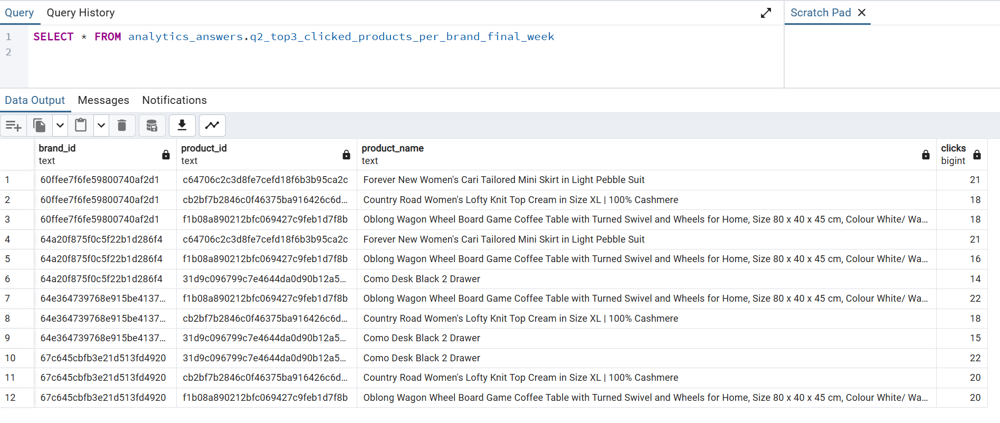
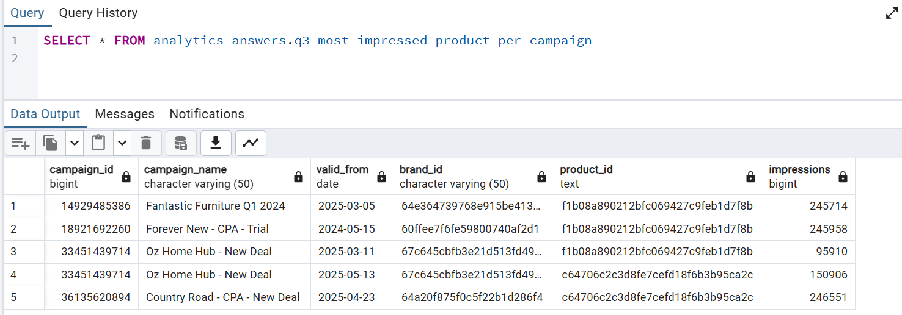
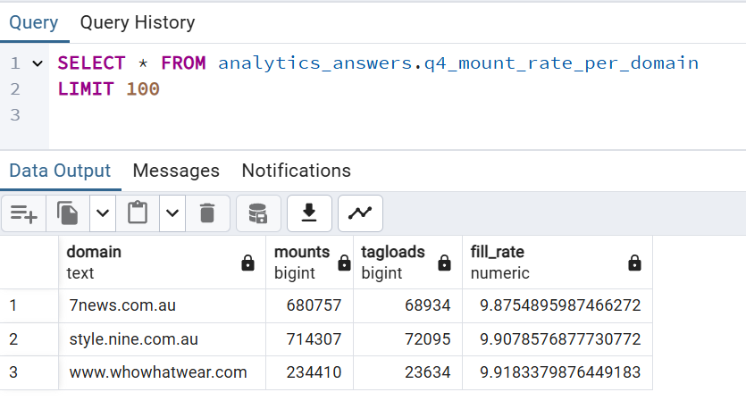
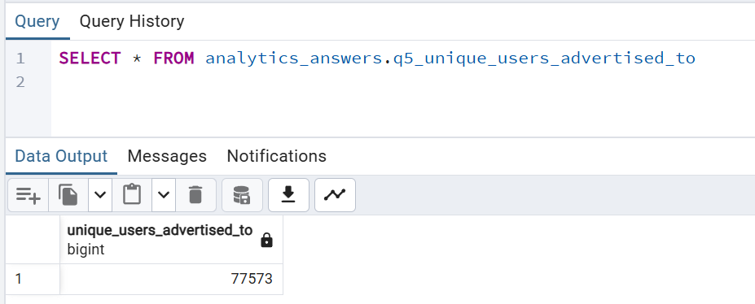

# dbt Models Documentation & Transformation Guide

This guide provides a comprehensive overview of all dbt models in the TRENDii data pipeline, explaining the transformation process from raw Parquet data to final analytical outputs.

# Table of Contents

1. [Data Flow Overview](#-data-flow-overview)
2. [Model Architecture](#-model-architecture)
   - [Layer 1: Sources](#layer-1-sources)
   - [Layer 2: Staging](#layer-2-staging)
   - [Layer 3: Marts](#layer-3-marts)
   - [Layer 4: Answers](#layer-4-answers)
3. [Model Catalog](#-model-catalog)
   - [Sources Layer](#sources-layer)
     - [raw.events_jsonl](#rawevents_jsonl)
     - [raw.events](#rawevents)
   - [Staging Layer](#staging-layer)
     - [src_events_raw](#src_events_raw)
     - [stg_events_base](#stg_events_base)
     - [stg_tagloads](#stg_tagloads)
     - [stg_mounts](#stg_mounts)
     - [stg_impressions](#stg_impressions)
     - [stg_clicks](#stg_clicks)
   - [Marts Layer](#marts-layer)
     - [dim_products](#dim_products)
     - [dim_campaigns](#dim_campaigns)
     - [f_impressions](#f_impressions)
     - [f_clicks](#f_clicks)
     - [f_mounts](#f_mounts)
     - [f_tagloads](#f_tagloads)
   - [Answers Layer](#answers-layer)
     - [q1_top_articles_by_domain](#q1_top_articles_by_domain)
     - [q2_top3_clicked_products_per_brand_final_week](#q2_top3_clicked_products_per_brand_final_week)
     - [q3_most_impressed_product_per_campaign](#q3_most_impressed_product_per_campaign)
     - [q4_mount_rate_per_domain](#q4_mount_rate_per_domain)
     - [q5_unique_users_advertised_to](#q5_unique_users_advertised_to)
4. [Transformation Patterns](#-transformation-patterns)
5. [Data Quality Framework](#-data-quality-framework)
6. [Business Logic Summary](#-business-logic-summary)
7. [Technical Implementation Details](#-technical-implementation-details)


## 📊 Data Flow Overview


## 🏗️ Model Architecture

### Layer 1: Sources
- **Purpose**: Define external data sources
- **Schema**: `raw`
- **Materialization**: Database tables/views

### Layer 2: Staging
- **Purpose**: Clean, standardize, and prepare raw data
- **Schema**: `staging`
- **Materialization**: Views (for performance and freshness)

### Layer 3: Marts
- **Purpose**: Business logic and dimensional modeling
- **Schema**: `marts`
- **Materialization**: Tables (dimensions) and Views (facts)

### Layer 4: Answers
- **Purpose**: Specific business question solutions
- **Schema**: `answers`
- **Materialization**: Views (for real-time results)

---

## 📋 Model Catalog

## Sources Layer

### `raw.events_jsonl`
- **Type**: Source table (PostgreSQL)
- **Purpose**: Landing zone for Parquet data
- **Structure**: Single JSONB column containing event data
- **Population**: Loaded via Python loader (`parquet-loader/pyarrow_loader_for_parquet_file.py`)

### `raw.events`
- **Type**: Source view
- **Purpose**: Structured access to JSONB data
- **Transformation**: Extracts common fields from JSONB
```sql
-- Key transformations:
(line->>'event_name')::text AS event_name
(line->>'event_created_at')::timestamptz AS event_created_at  
line->'event_data' AS event_data
line->'event_context' AS event_context
```

---

## Staging Layer

### `src_events_raw`
**File**: `models/staging/src_events_raw.sql`
**Materialization**: View
**Purpose**: Source convenience layer

**Transformation Logic**:
- Direct passthrough from `raw.events`
- Provides dbt source reference point
- No business logic applied

**Output Schema**:
- `event_name` (text)
- `event_created_at` (timestamptz)
- `event_data` (jsonb)
- `event_context` (jsonb)

---

### `stg_events_base`
**File**: `models/staging/stg_events_base.sql`
**Materialization**: View
**Purpose**: Extract common context fields from JSONB

**Transformation Logic**:
```sql
-- Extracts nested JSONB fields into columns
(event_context->>'eid')::text as eid
(event_context->>'publisher_id')::text as publisher_id
(event_context->>'domain')::text as domain
(event_context->>'url')::text as url
(event_context->>'did')::text as did
(event_context->>'ua')::text as ua
(event_context->>'pvid')::text as pvid
```

**Output Schema**:
- All fields from `src_events_raw`
- Plus extracted context fields (eid, publisher_id, domain, url, did, ua, pvid)

**Data Quality**: Tests for `event_name` not null

---

### `stg_tagloads`
**File**: `models/staging/stg_tagloads.sql`
**Materialization**: View
**Purpose**: Reconstruct page views from events

**Transformation Logic**:
1. **Deduplication**: Uses `DISTINCT` on pvid to identify unique page views
2. **Temporal Logic**: Uses `MIN(event_created_at)` to find first event per page view
3. **Window Function**: `OVER (PARTITION BY pvid)` for per-page calculations

```sql
-- Key transformation pattern:
select distinct
  pvid, domain, url, publisher_id, did, ua,
  min(event_created_at) over (partition by pvid) as first_seen_at
```

**Business Rules**:
- One record per unique `pvid` (page view ID)
- `tagload_at` = earliest timestamp for that page view
- Filters out records where `pvid` is null

**Output Schema**:
- `pvid` (text) - Page view identifier
- `domain`, `url`, `publisher_id`, `did`, `ua` (text)
- `tagload_at` (timestamptz) - Page load timestamp

**Data Quality**: Tests for `pvid` not null

---

### `stg_mounts`
**File**: `models/staging/stg_mounts.sql`
**Materialization**: View
**Purpose**: Extract ad unit mount events

**Transformation Logic**:
1. **Event Filtering**: `WHERE lower(event_name) IN ('mounts','mount','adunit_mount')`
2. **Array Expansion**: `LATERAL jsonb_array_elements(event_data->'mounts')`
3. **Field Extraction**: Extract mount-specific data from JSON

```sql
-- Array unnesting pattern:
from mounts_events e,
lateral jsonb_array_elements(e.event_data->'mounts') as m
```

**Business Rules**:
- One record per mount occurrence (not per event)
- Handles multiple mounts per event via array expansion
- Extracts mount metadata (image_id, mount_index)

**Output Schema**:
- Standard context fields (event_created_at, domain, url, etc.)
- `image_id` (text) - Mounted image identifier
- `mount_index` (int) - Position of mount on page

---

### `stg_impressions`
**File**: `models/staging/stg_impressions.sql`
**Materialization**: View
**Purpose**: Extract product impression events

**Transformation Logic**:
1. **Event Filtering**: `WHERE lower(event_name) IN ('impressions','impression')`
2. **Product Array Expansion**: `LATERAL jsonb_array_elements(event_data->'products')`
3. **Product Data Extraction**: Extract product details from JSON

```sql
-- Product array unnesting:
from imp_events e,
lateral jsonb_array_elements(e.event_data->'products') as p
```

**Business Rules**:
- One record per product impression (not per event)
- Handles multiple products per impression event
- Extracts comprehensive product metadata

**Output Schema**:
- Standard context fields
- `image_id` (text) - Associated image
- Product fields: `product_id`, `brand_id`, `product_url`, `product_name`, `product_price`, `product_image_url`

**Data Quality**: Tests for `product_id` not null

---

### `stg_clicks`
**File**: `models/staging/stg_clicks.sql`
**Materialization**: View
**Purpose**: Extract product click events

**Transformation Logic**:
1. **Event Filtering**: `WHERE lower(event_name) IN ('productclick','product_click','click')`
2. **Direct Field Extraction**: No array expansion (one click per event)
3. **Product Data Extraction**: Extract click-specific product data

**Business Rules**:
- One record per click event
- Includes click-specific identifier (`click_id`)
- Similar product data structure to impressions

**Output Schema**:
- Standard context fields
- Product fields (similar to impressions)
- `click_id` (text) - Unique click identifier

**Data Quality**: Tests for `product_id` not null

---

## Marts Layer

### `dim_products`
**File**: `models/marts/core/dim_products.sql`
**Materialization**: Table
**Purpose**: Product dimension from seed data

**Transformation Logic**:
- Direct selection from seeded CSV data (`dim_product.csv`)
- No transformations applied (pure passthrough)

**Business Rules**:
- Master product catalog
- Referenced by fact tables for product details
- Contains comprehensive product metadata (SKU, pricing, URLs)

**Data Quality**: 
- Tests for unique and not null `id`
- SKU uniqueness validation
- URL format validation (regex patterns)
- Price range validation (> 0)
- Relationship validation to brand dimension

**Seed Documentation**: Extensive column documentation in `seeds/schema.yml`

---

### `dim_campaigns`
**File**: `models/marts/core/dim_campaigns.sql`
**Materialization**: Table
**Purpose**: Campaign dimension from seed data with SCD Type 2 history

**Transformation Logic**:
- Direct selection from seeded CSV data (`dim_campaign.csv`)
- Contains temporal validity fields (`valid_from`, `valid_to`, `current_record`)
- Supports multiple pricing models (CPC, CPM, CPA)

**Business Rules**:
- Master campaign catalog with historical tracking
- SCD Type 2 implementation for campaign changes
- Used for temporal campaign attribution
- Supports different billing models per campaign

**Data Quality**: 
- Tests for `id` not null
- Unique combination of (id, valid_from)
- Valid date range validation (valid_from < valid_to)
- Accepted values for product_type (CPC, CPA, CPM)
- Rate validation per pricing model
- Relationship validation to brand dimension
- Single current record per campaign validation

**Custom Tests**:
- `assert_valid_date_ranges.sql` - Ensures valid_from < valid_to
- `assert_single_current_record_per_campaign.sql` - SCD Type 2 integrity
- `assert_no_gaps_in_campaign_history.sql` - Temporal continuity
- `assert_rate_consistency_with_product_type.sql` - Pricing model validation

---

### `f_impressions`
**File**: `models/marts/core/f_impressions.sql`
**Materialization**: View
**Purpose**: Product impression fact table

**Transformation Logic**:
- Clean selection of key impression fields
- Removes product detail fields (available via dimension join)

**Grain**: One record per product impression

**Output Schema**:
- Temporal: `event_created_at`
- Context: `domain`, `url`, `publisher_id`, `did`, `pvid`
- Keys: `image_id`, `product_id`, `brand_id`

---

### `f_clicks`
**File**: `models/marts/core/f_clicks.sql`
**Materialization**: View
**Purpose**: Product click fact table

**Transformation Logic**:
- Similar to impressions but includes `click_id`
- Clean fact table structure

**Grain**: One record per product click

---

### `f_mounts`
**File**: `models/marts/core/f_mounts.sql`
**Materialization**: View
**Purpose**: Ad unit mount fact table

**Transformation Logic**:
- Clean selection of mount-specific fields
- Includes mount positioning data

**Grain**: One record per mount occurrence

**Output Schema**:
- Standard context fields
- `image_id`, `mount_index`

---

### `f_tagloads`
**File**: `models/marts/core/f_tagloads.sql`
**Materialization**: Materialized View
**Purpose**: Page view fact table with optimized performance

**Transformation Logic**:
- Direct selection from staging tagloads
- Materialized for improved query performance on high-volume data

**Grain**: One record per unique page view (pvid)

**Output Schema**:
- `pvid` - Page view identifier
- Standard context fields (domain, url, publisher_id, did, ua)
- `tagload_at` - Page load timestamp

**Performance Notes**:
- Uses materialized view for better performance on aggregations
- Refresh strategy depends on data loading frequency

---

## Answers Layer

### `q1_top_articles_by_domain`
**File**: `models/answers/q1_top_articles_by_domain.sql`
**Materialization**: View
**Purpose**: Top 5 articles by traffic per domain

**Business Question**: "What are the most popular articles on each domain?"

**Transformation Logic**:
1. **Aggregation**: `COUNT(*)` tagloads by domain and URL
2. **Ranking**: `ROW_NUMBER()` partitioned by domain, ordered by tagloads DESC
3. **Filtering**: `WHERE rn <= 5` for top 5 per domain

```sql
-- Ranking pattern:
row_number() over (partition by domain order by tagloads desc, url) as rn
```

**Business Rules**:
- Traffic measured as unique page views (tagloads)
- Ties broken alphabetically by URL
- Results ordered by domain, then traffic DESC

---

### `q2_top3_clicked_products_per_brand_final_week`
**File**: `models/answers/q2_top3_clicked_products_per_brand_final_week.sql`
**Materialization**: View
**Purpose**: Top 3 clicked products per brand in the final week

**Business Question**: "Which products performed best in the most recent week?"

**Transformation Logic**:
1. **Time Bounds**: Calculate 7-day window ending at `MAX(event_created_at)`
2. **Temporal Filtering**: `BETWEEN min_day AND max_day`
3. **Aggregation**: Count clicks by brand and product
4. **Ranking**: Top 3 per brand by click count

```sql
-- Dynamic date range calculation:
max(event_created_at)::date as max_day,
(max(event_created_at)::date - interval '6 day')::date as min_day
```

**Business Rules**:
- "Final week" = 7 days ending with latest click timestamp
- Inclusive date range (includes both boundary dates)
- Ties broken alphabetically by product_id

---

### `q3_most_impressed_product_per_campaign`
**File**: `models/answers/q3_most_impressed_product_per_campaign.sql`
**Materialization**: View
**Purpose**: Most impressed product per campaign

**Business Question**: "Which product got the most impressions in each campaign?"

**Transformation Logic**:
1. **Temporal Join**: Join impressions to campaigns on brand_id and date range
2. **Campaign Attribution**: `event_created_at::date BETWEEN valid_from AND valid_to`
3. **Aggregation**: Count impressions by campaign and product
4. **Ranking**: Top 1 product per campaign

```sql
-- Temporal campaign attribution:
on dc.brand_id = i.brand_id
and i.event_created_at::date between dc.valid_from and dc.valid_to
```

**Business Rules**:
- Campaign attribution based on brand match + date range
- Only active campaigns (within validity period) considered
- One result per campaign (most impressed product)

---

### `q4_mount_rate_per_domain`
**File**: `models/answers/q4_mount_rate_per_domain.sql`
**Materialization**: View
**Purpose**: Fill rate (mounts/tagloads) per domain

**Business Question**: "How successful is ad mounting on each domain?"

**Transformation Logic**:
1. **Separate Aggregations**: Count tagloads and mounts by domain
2. **Full Outer Join**: Ensure all domains appear (even with 0 mounts/tagloads)
3. **Rate Calculation**: `mounts / tagloads` with zero-division protection

```sql
-- Fill rate calculation with safety:
case when coalesce(t.tagloads,0) = 0 then 0
     else coalesce(m.mounts,0)::numeric / t.tagloads::numeric
end as fill_rate
```

**Business Rules**:
- Fill rate = successful mounts per page view
- Handles edge cases (domains with no mounts or no tagloads)
- Results include absolute counts and calculated rate

---

### `q5_unique_users_advertised_to`
**File**: `models/answers/q5_unique_users_advertised_to.sql`
**Materialization**: View
**Purpose**: Count of unique users who received impressions

**Business Question**: "How many unique users did we reach with advertising?"

**Transformation Logic**:
- Simple `COUNT(DISTINCT did)` aggregation
- Uses device ID (`did`) as user identifier

**Business Rules**:
- User uniqueness based on device ID
- Includes all users who received at least one impression
- Single metric output

---

## 🔄 Transformation Patterns

### Common Patterns Used

1. **JSONB Extraction**:
```sql
(event_context->>'field_name')::target_type as field_name
```

2. **Array Expansion**:
```sql
from events e,
lateral jsonb_array_elements(e.event_data->'array_field') as item
```

3. **Window Functions for Ranking**:
```sql
row_number() over (partition by group_field order by metric desc) as rn
```

4. **Temporal Attribution**:
```sql
on condition AND date_field between start_date and end_date
```

5. **Safe Division**:
```sql
case when denominator = 0 then 0 
     else numerator::numeric / denominator::numeric 
end
```

6. **Materialized Views for Performance**:
```sql
{{ config(materialized='materialized_view') }}
```

### Data Quality Framework

#### Built-in dbt Tests
1. **Not Null Constraints**: Critical business keys
2. **Unique Constraints**: Dimension primary keys  
3. **Accepted Values**: Categorical field validation
4. **Relationships**: Foreign key integrity
5. **Range Validations**: Numeric field boundaries

#### Advanced Testing with dbt_expectations
1. **Regex Pattern Matching**: URL format validation
2. **Column Type Validation**: Data type enforcement
3. **String Validation**: Non-empty string checks
4. **Range Validation**: Enhanced numeric validations

#### Custom Business Rule Tests
1. **Temporal Consistency**: Date range validations (`assert_valid_date_ranges.sql`)
2. **SCD Type 2 Integrity**: Historical data consistency (`assert_single_current_record_per_campaign.sql`)
3. **Business Logic**: Domain-specific validations (`assert_rate_consistency_with_product_type.sql`)
4. **Data Completeness**: Gap detection (`assert_no_gaps_in_campaign_history.sql`)
5. **Future Date Prevention**: Sanity checks (`assert_future_end_dates.sql`)
6. **Uniqueness Validation**: Custom duplicate detection (`duplicates_click_id.sql`)

---

## 🎯 Business Logic Summary

### Key Concepts

- **Tagload**: A unique page view (identified by `pvid`)
- **Mount**: An ad unit successfully loaded on a page
- **Impression**: A product shown to a user
- **Click**: A user interaction with a product
- **Fill Rate**: Success rate of ad mounting (mounts/tagloads)
- **Campaign Attribution**: Linking events to campaigns via brand + date range

### Grain Definitions

- **Staging Models**: One record per raw event occurrence
- **Fact Tables**: One record per business event (impression, click, mount)
- **Dimension Tables**: One record per business entity (product, campaign)
- **Answer Models**: Aggregated metrics answering specific questions

## 🔧 Technical Implementation Details

### Data Loading Architecture
- **Python Loader**: Standalone Python script using psycopg2 and PyArrow
- **Batch Processing**: Efficient batch inserts for large Parquet files
- **Error Handling**: Robust connection management and transaction control
- **Environment Configuration**: Flexible configuration via environment variables

### Performance Optimizations
- **Materialized Views**: f_tagloads uses materialized views for heavy aggregation workloads
- **Staging Views**: Lightweight views for data freshness without storage overhead
- **Fact Tables**: Strategic use of views vs tables based on query patterns
- **Indexing Strategy**: Implicit through PostgreSQL query optimization

### Package Ecosystem
- **dbt_utils**: Utility macros for common transformations and tests
- **dbt_expectations**: Advanced statistical and pattern-based testing
- **codegen**: Development productivity tools for model generation

### Testing Strategy
- **Multi-layered Testing**: Built-in dbt tests + advanced expectations + custom business rules
- **Continuous Validation**: Tests run with every dbt build
- **Business Rule Enforcement**: Custom SQL tests for domain-specific logic
- **Data Quality Monitoring**: Comprehensive validation at seed, staging, and mart levels

