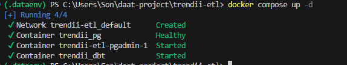
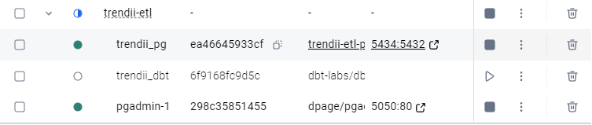
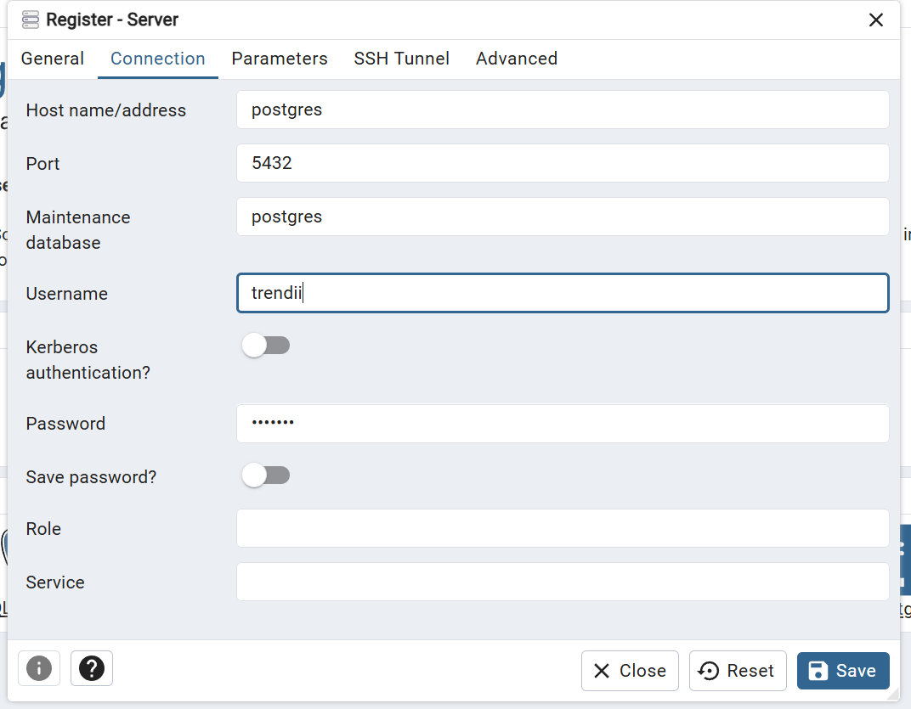
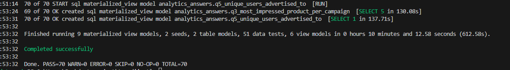
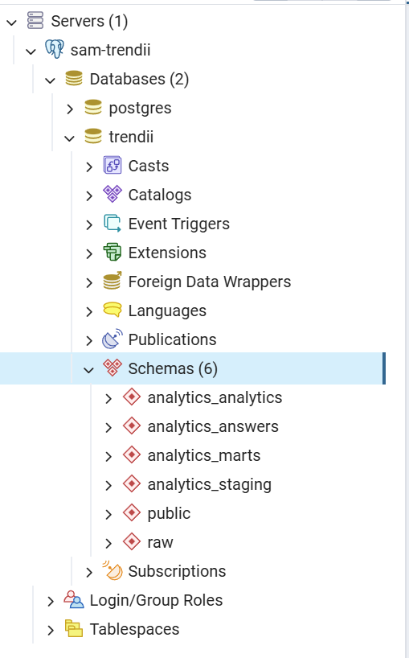
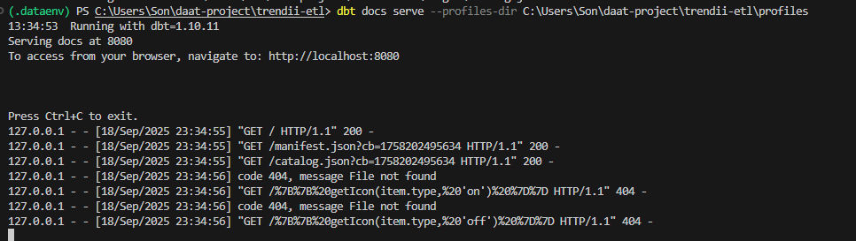
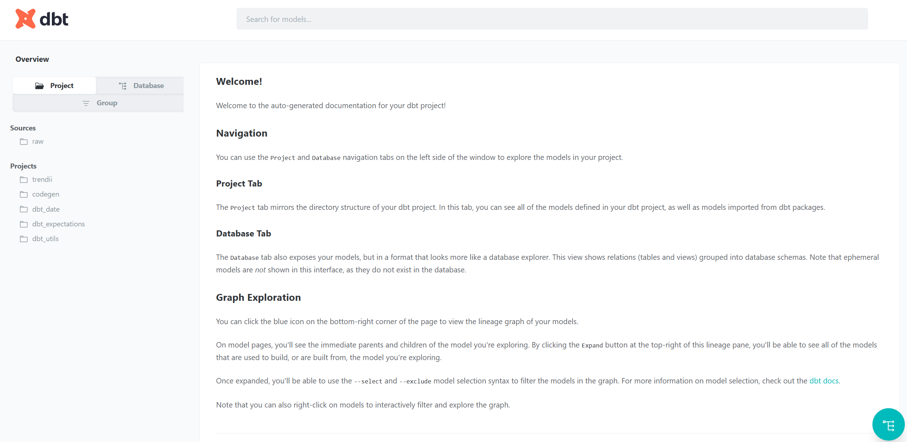
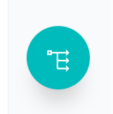
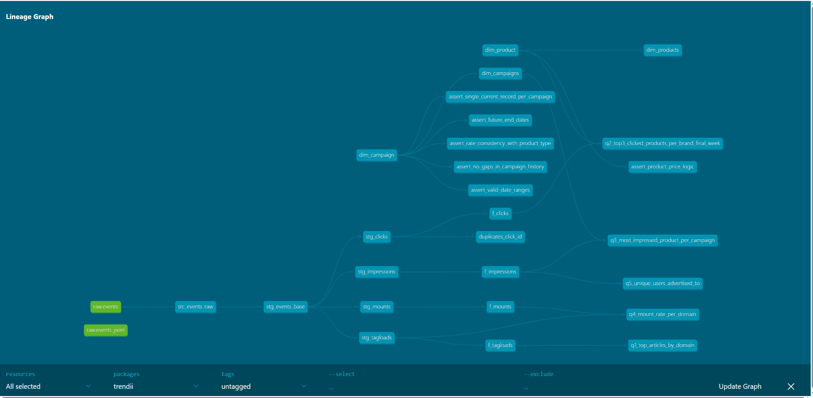
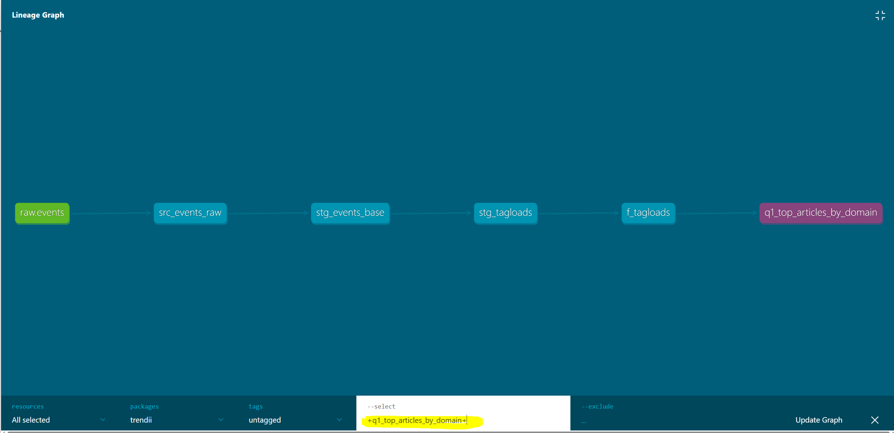

# TRENDii ETL — Setup and Run Guide

A complete data engineering solution built with Docker, PostgreSQL, and dbt that processes event data from Parquet files through staging, marts, and analytical models to answer business questions.

## 🏗️ Architecture

This project implements a modern ELT pipeline:
- **Extract**: Parquet files → PostgreSQL (PyArrow-enabled)
- **Load**: Raw JSONB storage with SQL views
- **Transform**: dbt models (Staging → Marts → Answers)

## 📁 Project Structure

```
trendii-etl/
├── sql/init/
│   └── 01_init.sql                 # Database schema setup
├── parquet-loader/
│   └── pyarrow_loader_for_parquet_file.py  # Python data loader
├── models/
│   ├── staging/                    # Raw data transformations
│   ├── marts/core/                 # Business logic layer
│   ├── answers/                    # Business question answers
│   └── schema.yml                  # Model tests & documentation
├── seeds/                          # Reference data (CSV)
│   ├── dim_product.csv
│   ├── dim_campaign.csv
│   └── schema.yml                  # Seed documentation & tests
├── tests/                          # Custom data quality tests
├── profiles/                       # dbt connection profiles
├── data/raw/events/                # Parquet files location
├── docker-compose.yml              # Container orchestration (with pgAdmin)
├── dbt_project.yml                 # dbt configuration
├── requirements.txt                # Python dependencies
└── .env                           # Environment variables
```
## Prerequisites
- Docker Desktop installed.
- On Windows, WSL2 enabled and Docker Desktop → Settings → **Resources → WSL Integration** turned on.
- Python 3.11+ available on PATH.

## 1) Create and activate a virtual environment
**Windows (PowerShell):**
```powershell
cd <your-working-directory>
py -m venv dataenv
.\dataenv\Scripts\Activate.ps1
```

## 2) Install Python dependencies
```bash
cd trendii-etl
pip install -r requirements.txt
```
Allow several minutes on the first run.

## 3) Start Docker services
Ensure Docker Desktop is running.

```bash
docker compose up -d
```

Wait until containers are healthy.



Verify PostgreSQL is running:



## 4) Load Parquet event data
- Create a folder named `events`.
- Copy all Parquet files into `events`.
- Copy the `events` folder to `data/raw`.

Run the loader:
```powershell
py parquet-loader/pyarrow_loader_for_parquet_file.py
```

## 5) Access pgAdmin
Open:
```
http://localhost:5050/
```


Credentials:
```
pgAdmin Access
URL: http://localhost:5050
Email: admin@example.com
Password: admin

Direct Database Connection
Host: localhost
Port: 5432
Database: trendii
Username: trendii
Password: trendii
```



## 6) Prepare and run dbt
Install packages:
```powershell
dbt deps
```

Set environment variables (PowerShell):
```powershell
$env:DBT_HOST="localhost"
$env:DBT_PORT="5432"
$env:DBT_USER="trendii"
$env:DBT_PASS="trendii"
$env:DBT_DB="trendii"
$env:DBT_SCHEMA="analytics"
```

Build:
```powershell
dbt build
```

A full run with tests and models typically takes several minutes and completes ~70 steps.



## 7) Inspect results in pgAdmin
Refresh the server; schemas should be visible.



Query answers in `analytics_answers` (the five materialized views).

## 8) Generate and view dbt docs
From `trendii-etl/profiles`:
```powershell
dbt docs generate
dbt docs serve
```




For lineage, click the green lineage button.




You can select specific models to filter the lineage view.



